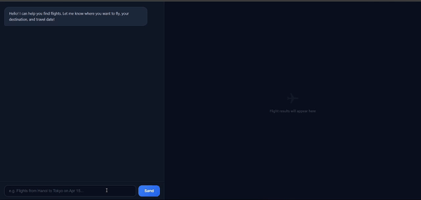

# Flight Search Agent

Search for flights the way you talk. Describe your travel plans in natural language and get instant flight options with prices, airlines, and schedules.

## Demo



## Features

- Multi-agent architecture: a main conversational agent delegates to a specialized search agent
- Streaming chat responses via SSE (Server-Sent Events)
- Flight results panel with Google Flights-style cards
- Real-time pricing and availability across multiple airlines
- Filter by price, duration, stops, cabin class, airlines, and more
- "Select flight" redirects to the airline's booking page

## Architecture

```
User <-> Main Agent (Travel Agent persona)
              |
              |-- calls search_flights tool
              |
         Search Agent (Parameter parser)
              |
              |-- calls SerpAPI Google Flights
              |
         Cache (JSON files)
```

- **Main Agent**: Friendly travel agent that gathers requirements and presents results
- **Search Agent**: Parses natural language into structured API parameters, handles fallbacks
- Both agents use Groq LLM (`gpt-oss-120b`) via LangGraph's `create_react_agent`

## Project Structure

```
Flight/
├── source/
│   ├── app.py              # FastAPI server, SSE streaming, booking endpoint
│   ├── main_agent.py       # Main conversational agent
│   ├── search_agent.py     # Search agent (parameter extraction + API call)
│   ├── tools.py            # SerpAPI Google Flights integration + caching
│   ├── prompts.py          # System prompts for both agents
│   ├── base.py             # Pydantic schemas
│   ├── utils.py            # Cache key generation + response cleaning
│   └── static/             # Frontend (HTML/CSS/JS)
├── cache/                  # Cached API responses (gitignored)
├── .env                    # API keys (gitignored)
├── requirements.txt
└── README.md
```

## Setup

```bash
git clone https://github.com/vandat2614/EasyFlight
cd Flight
python -m venv .venv
.venv\Scripts\activate      # Linux: source .venv/bin/activate
pip install -r requirements.txt
```

Create a `.env` file in the project root:

```
SERP_API_KEY=your_serpapi_key
GROQ_API_KEY=your_groq_key
```

Get API keys from:
- SerpApi: https://serpapi.com
- Groq: https://console.groq.com

## Run

```bash
python -m source.app
```

Open `http://localhost:8001`

## Tech Stack

- Python 3.11+
- FastAPI + Uvicorn
- LangChain + LangGraph
- Groq LLM
- SerpApi (Google Flights)
